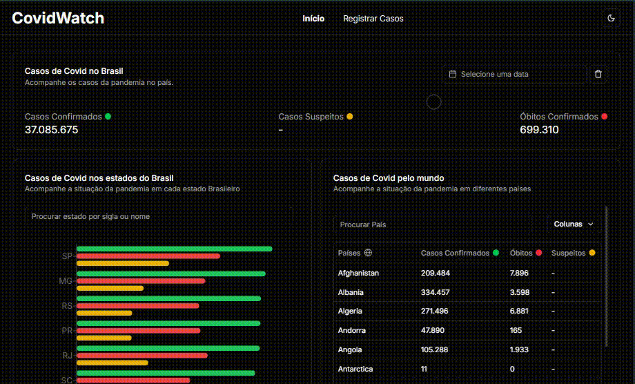

## Covid Watch

Uma aplicação projetada para monitorar os casos de Covid-19 no Brasil e no mundo, permitindo que os usuários acompanhem as estatísticas de casos confirmados, mortes e recuperações.
<br>
Link da Produção: <a href="https://covid-watch.vercel.app/">https://covid-watch.vercel.app/</a> 

### Para rodar o projeto:

```javascript
npm i -f
npm run dev

// Obs: Usei -f no npm i devido ao estar usando React 19 e Next 15 junto do Shadcn que ainda não está 100% otimizado para essa versão do React, ele recomenda em alguns componentes usar o -f
```

Abrir [http://localhost:3000](http://localhost:3000) para visualizar o front end

<hr>

### Gif mostrando tela inicial


### Gif mostrando tela de registrar caso + responsividade


<hr>

## Tecnologias

O projeto foi desenvolvido com as seguintes tecnologias:

### Front End:
- Next
- React
- Typescript
- Shadcn
- Tailwind
- Axios
- React Hook Form
- Zod
- Radix UI
- React Toastify
- Recharts

---

Linkedin de Matheus Bezerra --> <a href="https://www.linkedin.com/in/matheus-bezerra04/">Matheus-Bezerra04</a> <br />
E-mail: <a  href="malito:matheusbwzerra002@gmail.com">matheusbwzerra002@gmail.com</a>
<br />
Contato -> (11) 97661-1929
